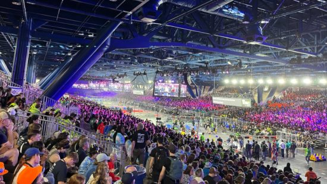
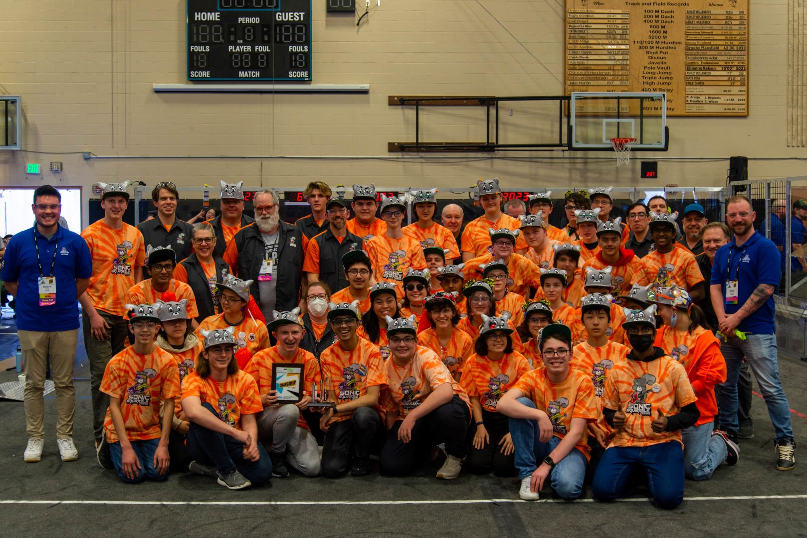
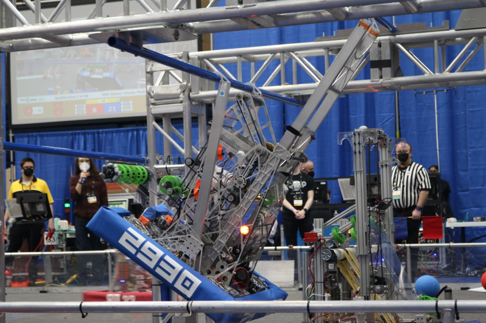
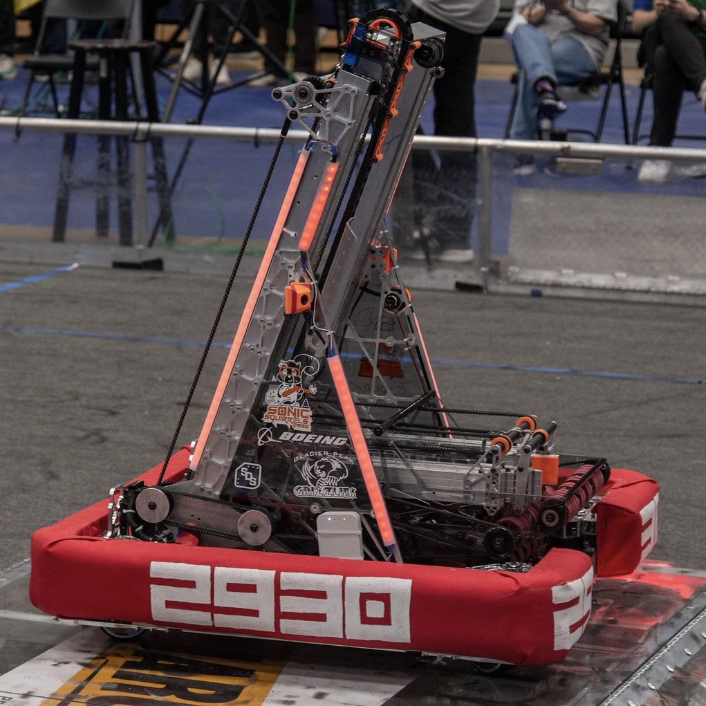
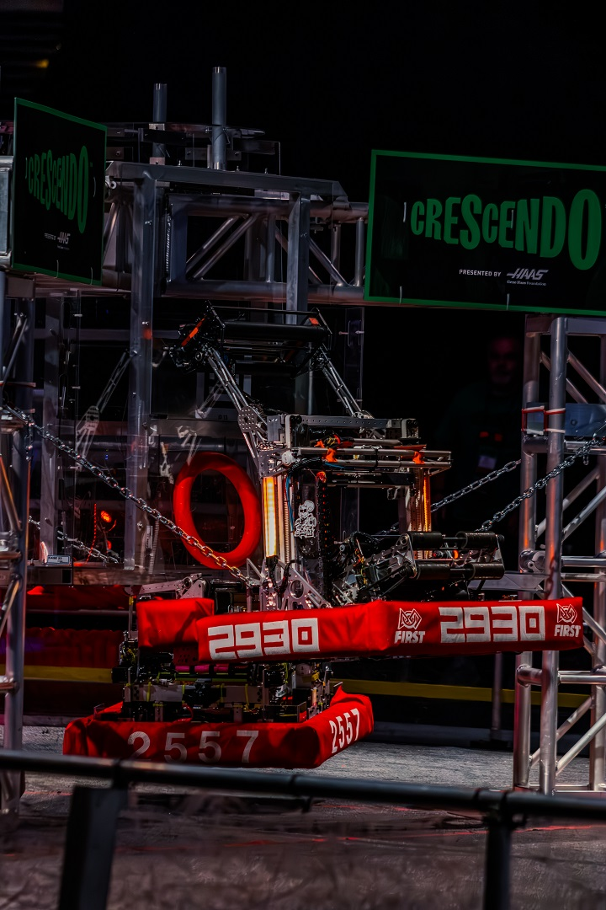
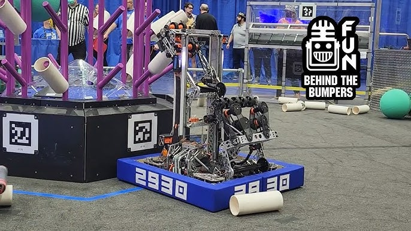

# FRC Experience
## What is FRC
[First Robotics Competition (FRC)](https://www.firstinspires.org/programs/frc/) is a global program that is a part of [FIRST (For Inspiration and Recognition of Science and Technology)](https://www.firstinspires.org/). The goal of FIRST is to give kids and young adults an environment where they can get hands on in engineering along with other students and mentors. Within FIRST, there are three main programs for all youth levels: [First Lego League (FLL)](https://www.firstlegoleague.org/) (Ages 4-16), [First Tech Challenge (FTC)](https://www.firstinspires.org/programs/ftc/) (Grades 7-12), and [First Robotics Competition (FRC)](https://www.firstinspires.org/programs/frc/) (Grades 9-12).
 
 
Here is Mark Rober (A well known Science Educator on YouTube) to explain more!
<iframe width="560" height="315" 
        src="https://www.youtube.com/embed/JnT4gssKqws" 
        title="YouTube video player" 
        frameborder="0" 
        allow="accelerometer; autoplay; clipboard-write; encrypted-media; gyroscope; picture-in-picture" 
        allowfullscreen>
</iframe>
 
Over 3700 high school teams from across the globe compete in the FRC challenge. On the first Saturday in January, FIRST releases the game reveal. The game reveal tells teams what their robots need to accomplish to earn points.
 
 
Here is an example of a game reveal from 2025 Rebuilt.
<iframe width="560" height="315" 
        src="https://www.youtube.com/embed/YWbxcjlY9JY" 
        title="YouTube video player" 
        frameborder="0" 
        allow="accelerometer; autoplay; clipboard-write; encrypted-media; gyroscope; picture-in-picture" 
        allowfullscreen>
</iframe>
 

After the game is revealed, teams begin designing, prototyping, fabricating, assembling, wiring, programming, and testing their robots. This engineering design process goes on for two months, after which competitions begin. Over the following two months, 350 [competitions](https://www.thebluealliance.com/events) happen all across the world. Teams that do well at these competitions are invited to the World Championships in Houston, Texas.

### Competition Structure

Competitions are split up into three phases. The first phase is qualification matches. Matches are three vs. three. So teams will get randomly assigned two teammates and three opponents. Teams that win matches and complete game objectives will recieve ranking points. At the conclusion of the qualification matches, teams are ranked by the number of ranking points they have. Then alliance selection happens.

<iframe width="560" height="315" 
        src="https://www.youtube.com/embed/xr69EMH4BZM" 
        title="YouTube video player" 
        frameborder="0" 
        allow="accelerometer; autoplay; clipboard-write; encrypted-media; gyroscope; picture-in-picture" 
        allowfullscreen>
</iframe>

Once teams have chosen their alliances, the playoff phase begins. Alliances face off to determine who the champions of the event are. Since 2023, this has been in the form of a double elimination bracket. At the same time, teams are given awards for building quality robots, making an impact in their communities, and overcoming challenges.

## The Sonic Squirrels
In high school, I joined [FRC #2930 The Sonic Squirrels](https://sonicsquirrels.com/).

### Freshman Year (2022)
My first year, I spent a lot of time learning Java, as well as all the software we use to control robots. I was pretty overwhelmed with this, but I enjoyed the program, and knew I had a lot of potential. That year, I wrote the software for our elevator system, allowing our robot to climb monkey bars.

Seeing the code I wrote work in competition was very motivating. Our team did well at our first two competitions that season, even winning the Sundome district event with [2910 Jack in the Bot](https://frcteam2910.org/). Because of this, we were invited to compete at the PNW District Championships. At that event, our team made it all the way to the semi-finals. 
 

Seeing the code I wrote bring our team to success was very motivating. Our team qualified for the World Championships in Houston and we flew down there to attend. The venue (the George R Brown Convention Center) was gigantic! There were hundreds of teams there from all over the world. Our team didn't make it very far due to how competitive the event was, but just attending was very inspiring. I was especially impressed by the world champions, [254 the Cheesy Poofs](https://www.team254.com/), that year. Their robot was nearly flawless and had some super nifty software features. I knew our team could improve a lot and I wanted to contribute to that.

### Sophomore Year (2023)

This year I made significant contributions to robot software. The main area I wrote code for was the autonomous period. During the autonomous period, there is no driver control and the robot must act completely on it's own using sensors and autonomous code. That year, I programmed our robot to use April Tags to determine it's position on the field. Once we had our position, I used autonomous pathing software like [Path Planner](https://pathplanner.dev/home.html) to create path following algorithms. After sequencing in movement of the scoring mechanism, we had a very effective autonomous.
 

At our first competition, I also spent less time cheering on our team in the stands and more time debugging issues in the pit. This was more fun for me and gave me experience working in a stressful environment. We won that first event alongside 2910 Jack in the Bot and [1778 Chill Out](https://www.chillout1778.org/). Additionally, we won the autonomous award. According to [FIRST's website](https://www.firstinspires.org/resources/library/frc/awards), the autonomous award "celebrates the team whose machine has demonstrated consistent, reliable, high-performance robot operation during autonomous (i.e. non-operated guided) actions during match play. Evaluation is based on the robot’s ability to sense its surroundings, position itself or onboard mechanisms appropriately, and execute tasks." This was very exciting because I was the one who wrote the autonomous code and tested it, and I was the one talking to the judges to explain how it worked.
 

At the following competition, we placed as finalists, and we won the autonomous award again! Because of our great performance, we qualified for the State Championships. Before attending the state championships, I added a feature to our auto that was beyond the scope of what the mechanical design was built for. I named the file that handled this action "Yeet.java". This video from the district championships shows what I'm talking about. Our team is in the top right. As a reminder, the autonomous period is the first 15 seconds of the game.
 

<iframe width="560" height="315" 
        src="https://www.youtube.com/embed/WgtQA9Q4k9Y" 
        title="YouTube video player" 
        frameborder="0" 
        allow="accelerometer; autoplay; clipboard-write; encrypted-media; gyroscope; picture-in-picture" 
        allowfullscreen>
</iframe>

That little move to throw the first purple cube we got saved us enough time to go and score a third game piece. Because of our autonomous consistancy and my communication skills with the jugdes, we won the autonomous award yet again! This was very honoring because the Pacific Northwest Regional is a very competitive event with plenty of other good autonomous routines. From there, we qualified for the world championships. I was unable to attend due to prior commitments with my high school's musical, but I was paying close attention. So when I heard that we had won the autonomous award again, I was extatic!!!

### Junior Year (2024)

### Senior Year (2025)

